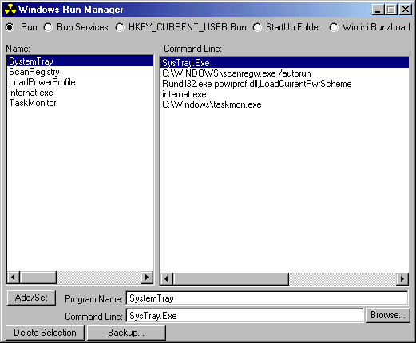



## Windows Run Manager

### Description

Ever wanted to get rid of annoying un-wanted or corrupt applications that starting when windows starts ?

this is the anwser!

this application enumerates and allows you to modify the registery run, run services (under HKEY_LOCAL_MACHINE and HKEY_CURRENT_USER),

modify Win.INI's Load and Run sections, and also add/remove icons from the Start Menu\Programs\StartUp folder...

and also export a backpup of the registry run to a valid .reg file

NOTE: This was tested on Win98, and also it might run on Win ME and Win 95, and it wasn't built for WinNT/2000.
 
### More Info
 

             |
---                |---
**Submitted On**   |2000-09-02 18:20:06
**By**             |[Max Raskin](https://github.com/Planet-Source-Code/PSCIndex/blob/master/ByAuthor/max-raskin.md)
**Level**          |Advanced
**User Rating**    |4.6 (37 globes from 8 users)
**Compatibility**  |VB 5\.0, VB 6\.0
**Category**       |[Complete Applications](https://github.com/Planet-Source-Code/PSCIndex/blob/master/ByCategory/complete-applications__1-27.md)
**World**          |[Visual Basic](https://github.com/Planet-Source-Code/PSCIndex/blob/master/ByWorld/visual-basic.md)
**Archive File**   |[CODE\_UPLOAD9527922000\.zip](https://github.com/Planet-Source-Code/max-raskin-windows-run-manager__1-11188/archive/master.zip)

